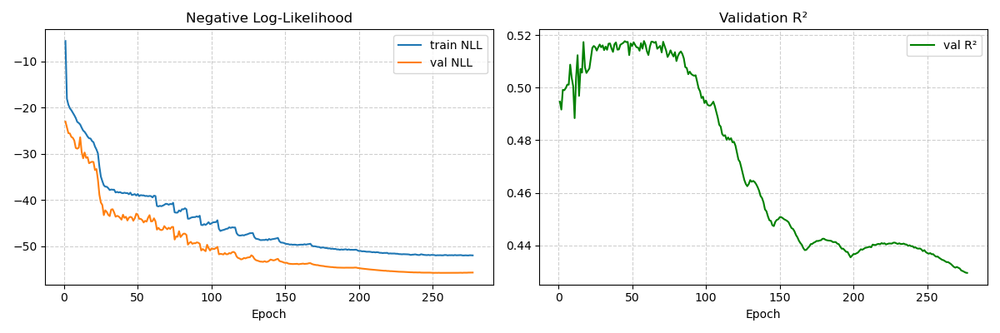

# Weather Prediction Neural Network

This project implements a probabilistic forecaster for Beijing air quality using a Temporal Convolutional Network (TCN) encoder topped with a Mixture Density Network (MDN) head. The network predicts a full distribution of possible outcomes instead of a single value. Because the training data covers only Beijing from 2010‑2014, the included model is best used as a starting point for **transfer learning**.



## About The Project
Traditional forecasting models provide a single point prediction, which fails to capture the uncertainty inherent in weather systems. This model outputs a Gaussian mixture distribution, producing richer forecasts and confidence estimates.

- **TCN Encoder** processes the last 72 hours of measurements and efficiently captures long‑range dependencies.
- **MDN Head** predicts the weights, means and standard deviations of a Gaussian Mixture Model.
- **Negative Log-Likelihood (NLL)** is the primary optimization metric.

## Key Features
- Probabilistic forecasting with a TCN + MDN architecture
- Resumable training with automatic checkpointing
- LayerNorm, GELU and softplus activations for stability
- Early stopping and learning rate scheduling
- GPU acceleration when available

## Results
Training for more than 250 epochs on the Beijing PM2.5 dataset yielded:
- **Best Validation NLL:** -55.82
- **Peak Validation R²:** ~0.52 around epoch 63
The model continued to improve its probabilistic skill long after the point‑forecast accuracy plateaued.

## Getting Started
### Prerequisites
- Python 3.9+
- `pip` or another package manager

### Installation
```bash
# Clone the repository

git clone https://github.com/MalyisGreat/Weather-Prediction-Neural-Network.git
cd Weather-Prediction-Neural-Network

# (Optional) create a virtual environment
python -m venv venv
source venv/bin/activate  # On Windows use .\venv\Scripts\activate

# Install dependencies
pip install -r requirements.txt
```

### Usage
Run the training script from the project root:
```bash
python advanced.py
```
The script downloads the Beijing dataset automatically and saves the best weights to `models/weather_tcn_mdn_best.pth`.


### Using the Pre-Trained Model
You can load the included weights and run inference without retraining:
```python
import torch
from advanced import TCN_MDN

# Replace <FEATURE_DIM> with the number of features produced by preprocessing
model = TCN_MDN(n_feats=<FEATURE_DIM>)
model.load_state_dict(torch.load("weather_tcn_mdn_best.pth", map_location="cpu"))
model.eval()
# `data` should be a tensor shaped (batch, SEQ_LEN, <FEATURE_DIM>)
dist = model(data)
```
`dist` is a `torch.distributions` object representing the forecast distribution.
=======


## Model Limitations
- **Concept Drift:** the model was trained on data from 2010‑2014 and will not accurately predict current conditions.
- **Geographic Specificity:** it was trained only on Beijing, so predictions for other locations will be unreliable.

## The Path Forward: Transfer Learning
To break through the limitations of the old dataset, load these weights into a wider model and fine‑tune on additional stations. A sample `transfer_learning.py` script demonstrates how to merge datasets and continue training.

## Repository Structure
- `advanced.py` – main training script
- `Figure_3.png` – architecture figure
- `weather_tcn_mdn_best.pth` – best model weights
- `weather_tcn_mdn_full.pth` – full model checkpoint
- `weather_scaler.pkl` / `weather_encoder.pkl` – preprocessing artifacts
- `requirements.txt` – list of Python dependencies

## License

Distributed under the MIT License. See [LICENSE](LICENSE) for details. This
permissive license encourages both academic and commercial use of the code.
=======
Distributed under the MIT License. See [LICENSE](LICENSE) for details.

